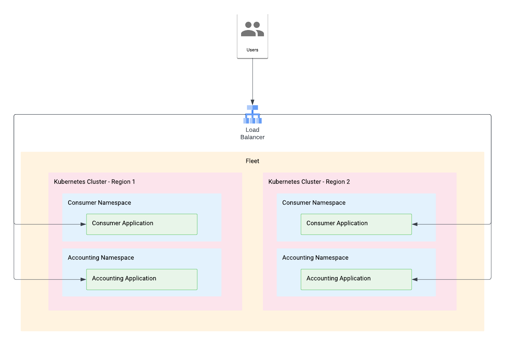

# ssl-gke-api-gateway

The purpose of this demo is to showcase a multi-cluster deployment and exposing deployments via a MultiClusterGateway, protected by a Google-managed SSL certificate with wildcards.



The idea is that you have two teams, Accounting and Consumer.  Both are running workloads on GKE, in their own respective namespaces.  

## Instructions

Before we dive into the configuration of the individual resources, let's talk about how to create everything in your environment.  Follow these instructions to create your Google Cloud environment and deploy the application to the GKE clusters.

First, create `terraform.tfvars` in the [Infrastructure-folder](./01_-_infrastructure) with the following values:

```shell
billing_account_id = "ABCDEF-ABCDEF-ABCDEF"
parent_id          = "folders/123456789"
domain             = "acme.com"
```

(Replace the values provided with the actual values for your environment)

You can simply run `install.sh` in the root of this folder and the script will take care of creating all the necessary resources.  Once the certificate has been provisioned, you can access the two exposed endpoints, on https://accounting.domain/v1/appinfo and https://consumer.domain/v1/appinfo.

**IMPORTANT**
Once the script has finished, it will instruct you to complete a few additional steps, in terms of DNS configuration.  If you don't execute these, it won't be possible to test the deployment.

## Sections

During the installation, you go through the following steps:
1. Create all the [infrastructure resources](./00_-_docs/infrastructure.md).
2. Build the [demo application](./00_-_docs/app.md) to expose 2 endpoints.
3. [Deploy](./00_-_docs/app.md) the demo application in two separate namespaces, on both clusters.
4. Create the [Gateway-resources](./00_-_docs/gateway.md) for both domains

Please refer to the linked documentation above to understand what is happening in each individual section.

